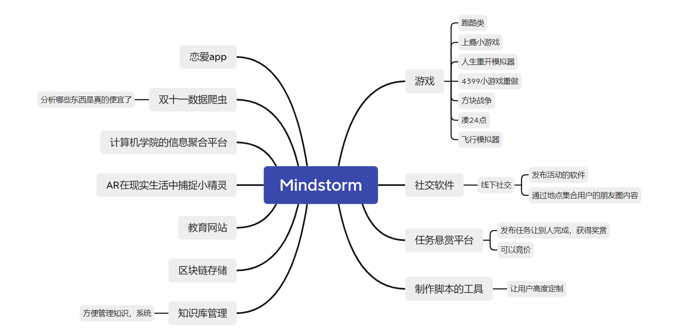

# 立项会议

 * **参会者**：常庆宇，王越，谭亚君，刘济源，张睿
 * **时间**：2020年10月27日
 * **地点：** 南一楼
 * **会议记录**：张睿 

## 头脑风暴

经讨论，我们最终选择了**地点社交** 这个项目

## NABCD分析

- N(Need)

  做一个与现实紧密结合的社交平台。

  具体领域：陌生人社交、线上+线下社交。

  具体而言：

  - 目前线上陌生人社交的一大痛点是对对方不信任，其根源是线上社交本身的真实性存疑，而通过对附近自己熟悉的地点为社交基础，更能增加人与人之间的信任度。
  - 还有一大痛点是线上社交往往会“尬”住，即缺少共同话题，而通过地点社交，则天然就存在着一个共同话题---地点
  - 目前线上陌生人社交的一个痒点是时效性，目前线上社交的照片并没有时效性，而采用朋友圈+短视频的形式，以时间顺序排序则拥有了时效性

- A(Approach)

  不同人对相同地点分享当前地点相关的动态（类似朋友圈+短视频形式），通过地图选点查看动态，达到社交的目的。

- B(Benefit)
  - 形式新颖，可以吸引年轻人的目光
  - 把现实和社交紧密结合，不仅可以增强社交的真实性和时效性，还可以天然地提供共同话题。
  - 朋友圈+短视频似的简短分享符合当今“短平快”的理念，即社交也应“短平快”
  - 以地点为中心的陌生人社交不以传统的“个人简历”形式介绍自己，而是基于“共同话题”为中心的社交，即--地理位置。
  - 以地理位置为中心的社交天生带有“团聚”的特性，即可以把附近的人聚集起来。

- C（Competitors）

  - 迈迈

    功能：

    1. 旅游照片分享，每个人在各地发的照片都在地图上展示出来，照片变成了一扇窗口，点击照片拍摄位置，就能看到这个地方其他人留下的内容。
    2. 记录，个人的照片会随着时间和位置的变化形成个人在地图上的轨迹。
    3. 连接，首先是地图上人和人的连接，可以通过拖动地球的映射——地图，去跟地球上所有的人聊天。其次，人和事件的连接，最直观的表现，比如在上海开的周杰伦演唱会，去的人和没去的人，通过共同关注和参与的事件，从而跨越空间，联系到一块儿。

    优点：

    1. 几乎完成了我们想完成的全部功能，而且还有额外的bonus

    缺点：

    1. 功能太多，交互繁琐
    2. 动态显示页面信息过少，只有一张图片，无法体现社交
    3. 不支持短视频

  

  - 知更

    功能：

    1. 地图社交---显示附近的人
    2. 可在地图上记录自己的照片

    优点：

    1. 简洁明了，颜值高
    2. 有基于地点的动态

    缺点：

    1. 地点动态粒度过大，以学校为单位
    2. 附近的人这个功能具有法律、和真实性风险
    3. 不支持短视频

- D（Delivery）---略

## 下次会议事项

- 会议时间地点：2021.11.03 南一楼
- 会议准备：
  - 了解app开发的相关技术，包括但不限于：
    - app技术架构
    - 前端框架
    - 后端框架
    - UI设计
    - 测试技术
    - 各类文档撰写（需求文档，设计文档，测试文档等）
  - 事先构思一下需求有什么，所期望的功能有什么。
- 会议主要目标：
  - 确定具体实现形式（小程序？ios？安卓？）
  - 确定分工（产品设计、技术开发、文档撰写）
  - 确定具体需求，构思产品功能
  - 大致确定开发计划
  - 完成产品设计初稿

## 会议图片

