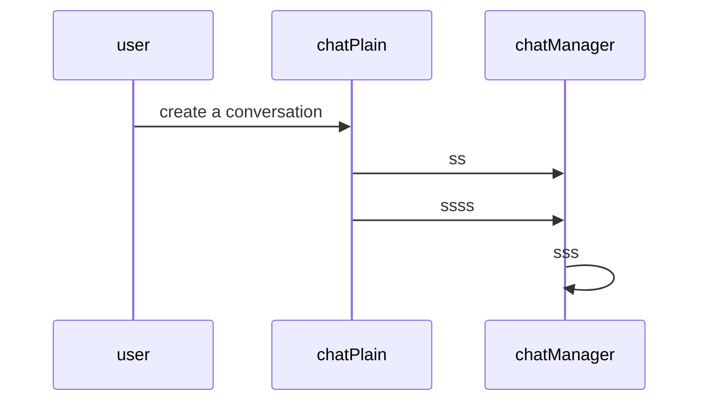

- 执行
- 边界
- 控制
- 辅助/实体

1. 用户管理
   1. 用户
   2. 用户登陆界面类
   3. 登陆控制类
      1. 注册类--实体类
      2. 登陆类
   4. 用户信息界面类
   5. 用户信息控制类
      1. 用户数据类

2. 地图
   1. 用户
   2. 地图界面类
   3. 地图控制类
      1. 搜索地点
      2. 选择地点
      3. 地图操控（拖动，放缩）
3. 动态
   1. 地图
   2. 动态界面类
   3. 动态控制类
      1. 动态数据类
      2. 动态操作类

4. 活动
   1. 地图
   2. 活动界面类
   3. 活动控制类
      1. 活动数据类
      2. 活动操作类
5. 聊天
   1. 用户
   2. 聊天界面类
   3. 聊天控制类
      1. 成员管理类
         1. 管理员类
         2. 普通成员类
      2. 消息处理类

