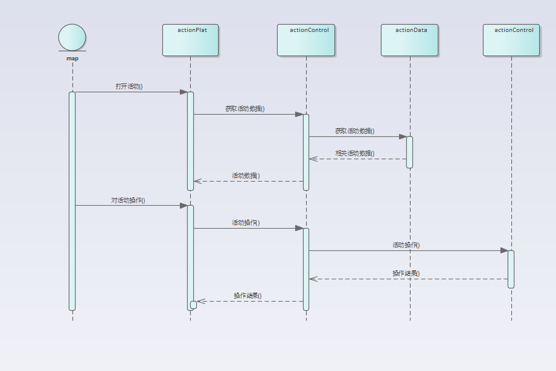
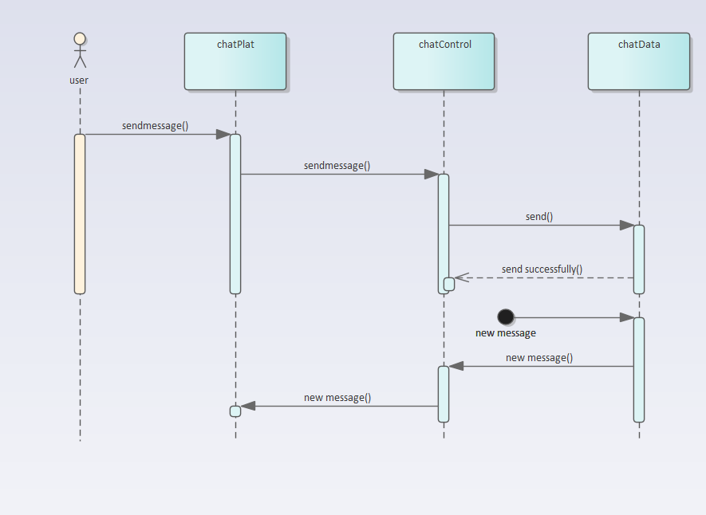
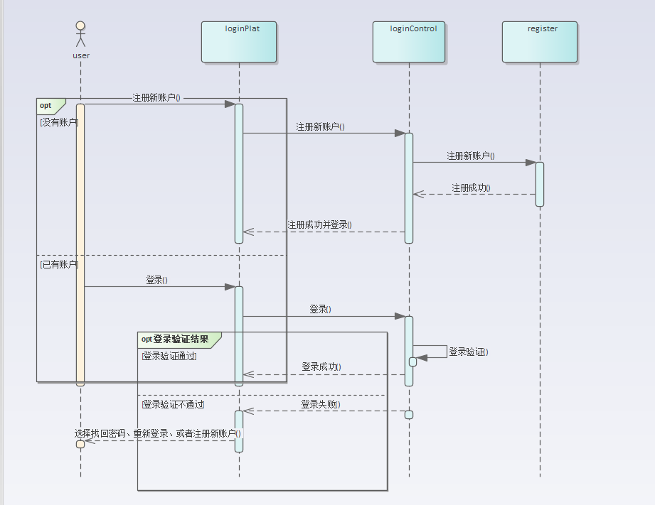
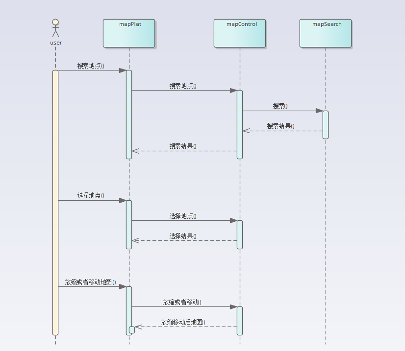
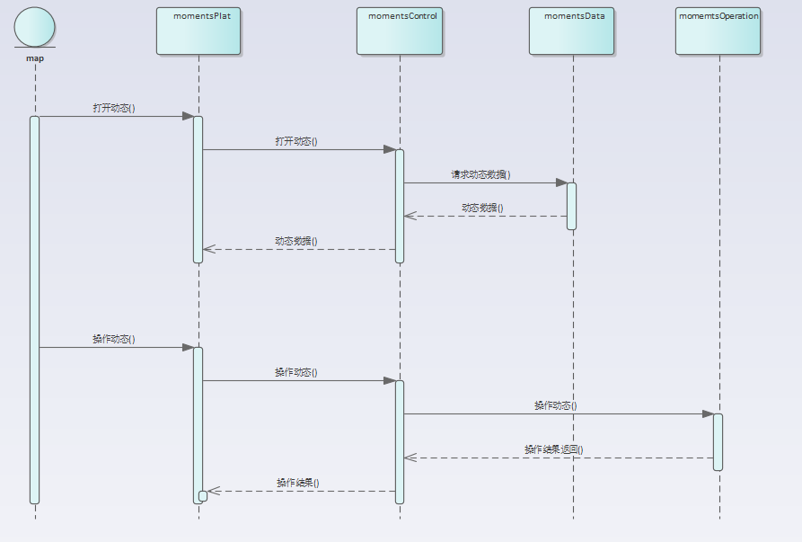

## 产品描述

​	在小组讨论头脑风暴中我们在社交软件、游戏、教育网站等一众备选项中选择了这项基于地点的社交软件。按照NABCD的思路细致分析了我们选择的可行性和合理性，小组成员充分讨论。在项目管理上我们使用Gitee平台对我们的整个开发过程进行记录和共享。目前就细节方面尚在讨论之中。我们的大致目标是能够完成一个基于地点的社交手机app。

## 产品功能

​	目标是做一个与现实紧密结合的社交平台。我们主要涉及的领域包括陌生人社交、线上+线下社交。社交平台针对不同用户实现不同的功能。首先是管理员，管理员有查看后台数据的权限，管理不同地点的评论区，并且可以适时推出某些活动来提高用户的参与度；其次是一般用户，这类用户是平台活跃度主要的提供者，他们经过登陆后即可在不同地点发布、参与活动、发表评论；最后是游客，游客可以获取不同地点的有限评论和动态，并且可以看到一定范围的活动，但如果要加入聊天室则需要成为一般用户才行。

## 软件用例

- ~~注册/登录~~
  1. ~~输入手机号和验证码成功注册/登录~~
- ~~忘记密码~~
  1. ~~在登陆界面点击忘记密码~~
  2. ~~输入手机号及验证码~~
  3. ~~重设密码并保存~~
  4. ~~进入主界面~~
- 用户登录
  - 微信第三方登录
- 搜索地点
  1. 点开地图界面
  2. 在搜索栏搜索相应地点
  3. 地图显示搜索点附近的地图并标记搜索点
- ~~地图选点发图文动态~~
  1. ~~在地图界面通过拖动，放缩粒度，选择一个给定的点。~~
  2. ~~点击选定的点，进入动态展示界面。在这里可以看到他人在该点按时间顺序发的动态。~~
  3. ~~点击创建动态图标，选择图文动态，编辑动态并发布，动态包括图文和短视频~~
  4. ~~界面跳回动态展示界面，可发现刚刚发出的动态。~~
- 地图发动态
  - 首页为当前地点的动态
- 地图选点评论点赞动态
  1. 在地图界面通过拖动，放缩粒度，选择一个给定的点。
  2. 点击选定的点，进入动态展示界面。在这里可以看到他人在该点按时间顺序发的动态。
  3. 点击动态的更多，选择评论或点赞
  4. 打字输入评论或点赞
- 地图选点发布活动
  1. 在地图界面通过拖动，放缩粒度，选择一个给定的点。
  2. 点击选定的点，进入动态展示界面，选择活动页面，在这里可以看到他人在该点按推荐算法排序的活动。
  3. 点击创建活动，编辑活动信息并发布
  4. 界面跳回活动展示界面，可发现刚刚发出的活动。
- 地图选点加入活动并和组内成员交谈
  1. 在地图界面通过拖动，放缩粒度，选择一个给定的点。
  2. 点击选定的点，进入动态展示界面，选择活动页面，在这里可以看到他人在该点按推荐算法排序的活动。
  3. 选择一个活动查看活动具体信息。
  4. 点击加入活动，进入活动聊天室。
  5. 回到主页点击聊天，可看到增加了一个活动聊天室。
  6. 点击活动聊天室即可和组内成员沟通
- 聊天室管理员发布群公告
  1. 点击聊天页面
  2. 点击相应的活动聊天室
  3. 点击更多
  4. 点击发布群公告
- 聊天室管理员@全体成员
  1. 点击聊天页面
  2. 点击相应的活动聊天室
  3. 在打字栏@全体成员
- 查看我的动态
  1. 点击我
  2. 点击我的动态可以看到自己曾发过的动态
- 修改昵称性别头像等账号信息
  1. 点击我
  2. 点击头像进入账号信息界面
  3. 点击相应栏进行编辑并保存

## 时序图

​	action:

chat:

login:

map:

moment:

## UML类图

## 原型设计

https://modao.cc/app/32abcaebf7291a68b2465775141f579b934b8564 《地点社交》 

